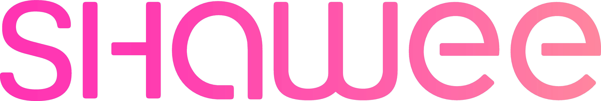

# Platform

EGOH will use [Shawee](https://shawee.io) as the main platform of the hackathon to connect the team with juries, mentors, submiting the projects to evaluation and fostering their continuity and development.

